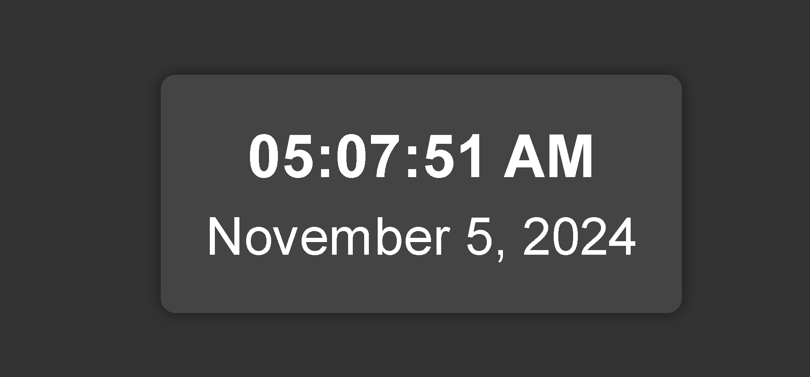

# Real-Time Digital Clock

A sleek, real-time digital clock application displaying the current date and time in an easy-to-read format. This clock refreshes every second to provide accurate timekeeping, making it ideal for desktop use, embedding in other applications, or learning basic GUI programming.

## Overview

This digital clock application is designed to:
- Display the current time in `HH:MM:SS` format
- Show the current date in a readable `DD-MM-YYYY` or `MM/DD/YYYY` format
- Update the display every second to ensure accurate time

## Screenshot

  

## Installation & Setup

1. **Clone the Repository**:
   git clone https://github.com/itsalokbarnwal/Real-Time-Digital-Clock.git
